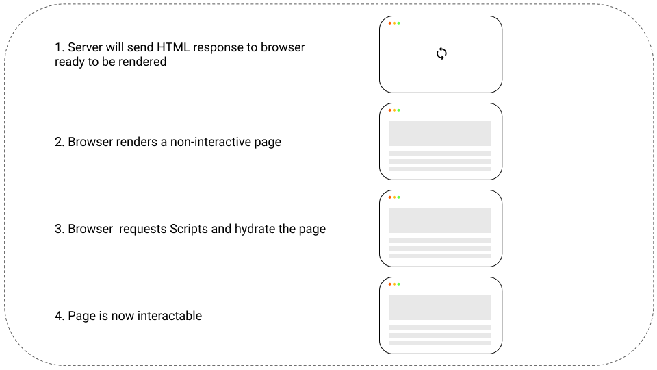

# Client

## Next.js

For this project, Next.js was choosed over Gatsby and create-react-app for his server-side rendering capabilities and for his SEO support.

## Ui Library

## Local State Management

Apollo Client

## Generate GraphQL Types

GraphQL Code Generator

## Development

| Service |       URI        | Port |
| :------ | :--------------: | ---: |
| Client  | http://localhost | 3000 |

## Production

| Service |                URI                 | Port |
| :------ | :--------------------------------: | ---: |
| Client  | https://blueberry-shop.vercell.app |   80 |
