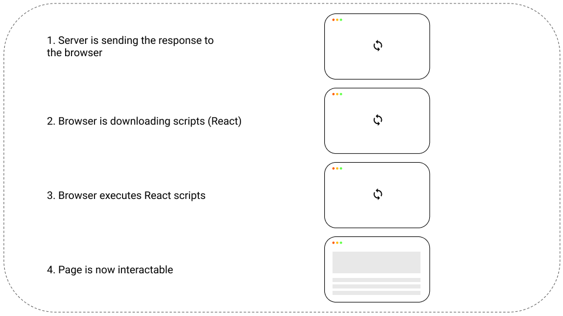
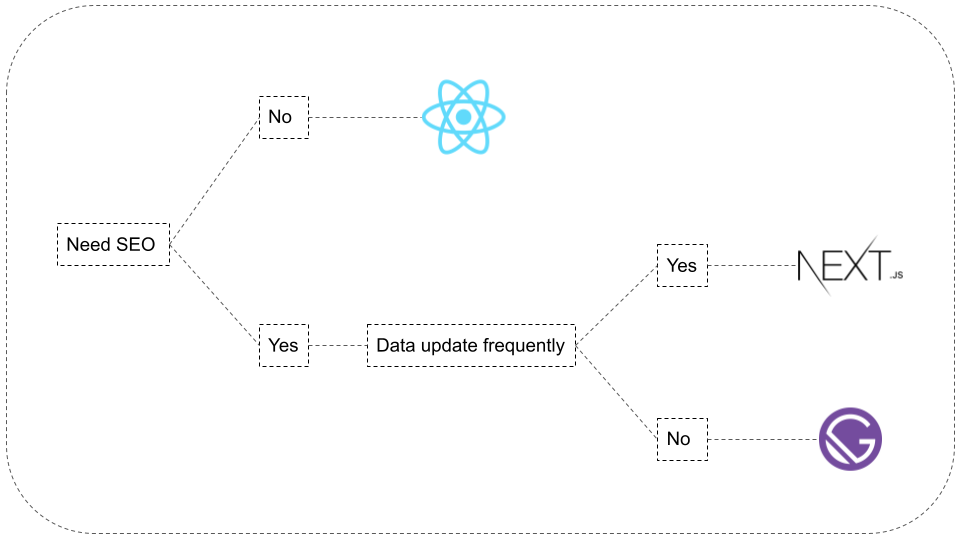

# Client

<hr/>

## Client Side Rendering

Client side rendering is faster at rendering after initial load, it comes with greate user experience, good variety of libraries and frameworks.

Client side rendering doesn't shine with initial load time and SEO. For the moment, search engines like Bing, Yandex and more struggle to index web pages with a lot of Javascript, their ranking performs badly.

<figure>
  
  <figcaption>Personal Diagram</figcaption>
</figure>

<hr/>

## Server Side Rendering

In contrast to client side rendering, Javascript is rendered as HTML, making it possible to be indexed in the first round trip by search engines and improve SEO.

Initial load times are improved, allowing users to get content much faster in opposite with client side rendering. Decreasing load time, improves SEO and converts more clients.

The process of server side rendering after initial load is higher than with client side rendering.

<figure>
  
  <figcaption>Personal Diagram</figcaption>
</figure>

<hr/>

## Project Choice

For this project, Next.js was choosed over Gatsby and create-react-app for it's server-side rendering capabilities and for it's SEO support.

<figure>
  
  <figcaption>Personal Diagram</figcaption>
</figure>

<hr/>

## State Management

<figure>
  
  <a href="https://www.apollographql.com/docs/react/local-state/local-state-management/">
  <figcaption>Image: Inspired From Apollo Docs</figcaption>
  </a>
</figure>

<hr/>

## GraphQL Code Generator

=== "GraphQL Code Generator Development"

    ```YAML
    overwrite: true
    schema: ${NEXT_PUBLIC_DEVELOPMENT_SERVER}
    documents: "./Graphql/**/*.graphql"
    # watch: true
    generates:
      Graphql/graphql-hooks.ts:
        plugins:
          - "typescript"
          - "typescript-operations"
          - "typescript-react-apollo"
        config:
          withHOC: false
          withComponent: false
          withHooks: true

    ```

=== "GraphQL Code Generator Production"

    ```yaml
    overwrite: true
    schema: ${NEXT_PUBLIC_PRODUCTION_SERVER}
    documents: "./Graphql/**/*.graphql"
    # watch: true
    generates:
      Graphql/graphql-hooks.ts:
        plugins:
          - "typescript"
          - "typescript-operations"
          - "typescript-react-apollo"
        config:
          withHOC: false
          withComponent: false
          withHooks: true
    ```

<hr/>

## Environement Variables

By creating an <b>.env.local</b> environment file, it's possible to add information and then retrieve it in the application at any time.
It behaves like a central store, it's perfect for storing repeatable information like URLs.

!!! warning

    All the information exposed in Next.js are not private, every one can see them.
    Do not store confidential information on Next via environement variables.

=== ".env"

```
NEXT_PUBLIC_DEVELOPMENT_SERVER=http://localhost:4000/graphql
NEXT_PUBLIC_PRODUCTION_SERVER=https://blueberryshop.herokuapp.com/graphql
```

Retrieving information can be done like the following

```
process.env.NEXT_PUBLIC_DEVELOPMENT_SERVER
```

<hr/>

## Libraries

| Library                |                             URI                             | Description                                                                                                                                                                                               |
| :--------------------- | :---------------------------------------------------------: | :-------------------------------------------------------------------------------------------------------------------------------------------------------------------------------------------------------- |
| Typescript             |          [Link](https://www.typescriptlang.org//)           | Typescript is a superset of Javascript, it allows to add types in development and detect compilation errors at compile time.                                                                              |
| Next.js                |                 [Link](https://nextjs.org/)                 | Next.js is a server side rendering framework built on top of React, it optimizes search engine results.                                                                                                   |
| Material-UI            |              [Link](https://material-ui.com/)               | Material-UI is a UI library component kit built on Google's material design system.                                                                                                                       |
| React Hook Form        |            [Link](https://react-hook-form.com/)             | React Hook Form is a light and performant library built on top of React hooks, it makes form validation very easy.                                                                                        |
| Apollo Client          |      [Link](https://www.apollographql.com/docs/react/)      | Apollo Client is a client GraphQl library, it's simple API allows to use it as a local state management tool and to quickly write business code which mathers, in comparison of Redux's long boilerplate. |
| GraphQL Code Generator |         [Link](https://graphql-code-generator.com/)         | GraphQL Code Generator allows to convert a GraphQL API into Typescript.                                                                                                                                   |
| Apollo-Upload-Client   | [Link](https://github.com/jaydenseric/apollo-upload-client) |                                                                                                                                                                                                           |

<hr/>

## Sources

| Source                                    |     Author      |                                                                                                     URI |
| :---------------------------------------- | :-------------: | ------------------------------------------------------------------------------------------------------: |
| Apollo Server and Client Auth Example     | Next.js Example | [Link](https://github.com/vercel/next.js/tree/master/examples/api-routes-apollo-server-and-client-auth) |
| Apollo Client State Management Example    | Apollo Example  |                                 [Link](https://github.com/apollographql/ac3-state-management-examplesx) |
| Strongly Typed Next.js                    | Michael Stromer |                            [Link](https://michaelstromer.nyc/books/strongly-typed-next-js/introduction) |
| Typescript, Next GraphQL Youtube Playlist |    Ben Awad     |                                                                    [Link](https://youtu.be/kfmh2mMf3fs) |
| Demo Ecommerce                            |     Vercel      |                                                                      [Link](https://demo.vercel.store/) |
| Github Demo Ecommerce                     |     Vercel      |                                                              [Link](https://github.com/vercel/commerce) |

<hr/>
